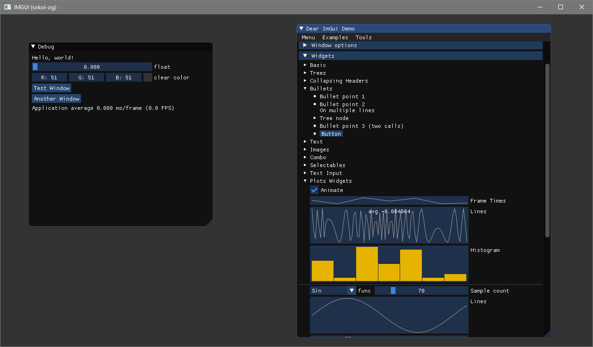
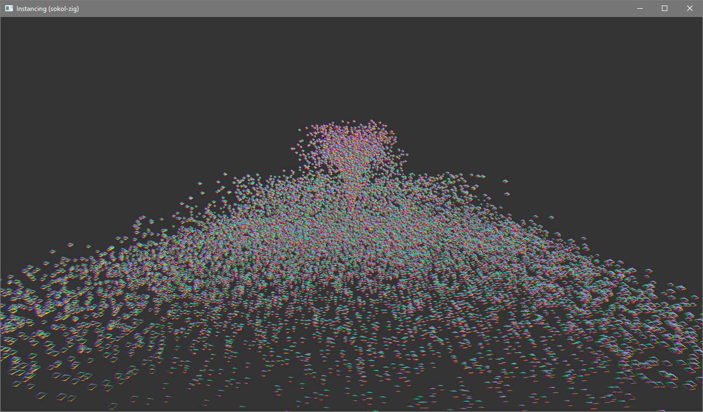
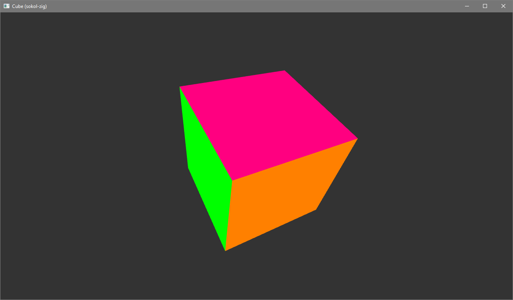
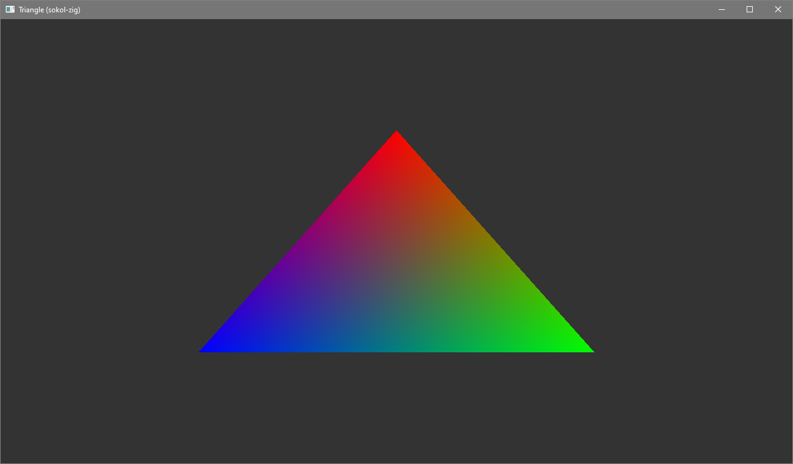

# sokol-zig-examples

Some of the Sokol examples running in Zig 0.12.0 (April 2024). Intended to be used as a reference or starting point for anyone looking to use Zig make games. Working platforms:
 - Windows (OpenGL)
 - MacOS (OpenGL)
 
With some modifications to the build.zig script it could be modified to target other platforms.

See
   - https://github.com/floooh/sokol
   - https://github.com/floooh/sokol-samples
   - https://github.com/floooh/sokol-zig
   - https://github.com/ziglang/zig

## Building

Clone

    git clone --recurse-submodules https://github.com/jeffkdev/sokol-zig-examples.git
    
    
Navigate to the root directory and run application using:

    zig build run
    
   
To run different examples change the main file in the build.zig file:
```    const main_file = "example_instancing.zig"; ```

valid files are:
  example_imgui.zig

  
  example_instancing.zig


  example_cube.zig

  
  example_triangle.zig


  example_sound.zig
(plays beeping sound, blank screen)
  
  
## Shaders

The "glsl.h" shader files are generates from the ".glsl" files using. [sokol-shdc](https://github.com/floooh/sokol-tools). Since the glsl.h files are not created automatically when building right now they are checked in as well. If you modify the files, they can be re-generated using the command:

```
sokol-shdc.exe --input cube.glsl --output cube.glsl.h --slang glsl430 --format sokol_impl
```
A python file build_shaders.py is included for convenience that will create the required glsl.h files and the *_compile.c files which calls the above command for each listed file (requires sokol-shdc.exe in the environment paths).

The "--format sokol_impl" is important, otherwise they will be generated with inline declarations which caused issues using them in Zig. See the [documentation](https://github.com/floooh/sokol-tools/blob/master/docs/sokol-shdc.md) for more command line references.

## Debugging

Debugging and breakpoints are working in Visual Studio Code. Ideally there would be a launch config for each example, but right now it just runs the program.exe that is created from the zig build. Two files are required in the .vscode folder (not included in repo):

### tasks.json
```
{
    "tasks": [
        {
            "group": "build",
            "problemMatcher": [
                "$msCompile"
            ],
            "command": "zig build",
            "label": "zig_build",
            "options": {
                "cwd": "${workspaceRoot}"
            },
        },
    ],
    "presentation": {
        "reveal": "always",
        "clear": true
    },
    "version": "2.0.0",
    "type": "shell"
}
 ```
### launch.json
```
{
    "version": "0.2.0",
    "configurations": [
        {
            "environment": [],
            "stopAtEntry": false,
            "program": "${workspaceRoot}/zig-out/bin/program.exe",
            "name": "program",
            "console": "integratedTerminal",
            "preLaunchTask": "zig_build",
            "request": "launch",
            "args": [],
            "type": "cppvsdbg",
            "cwd": "${workspaceRoot}"
        }
    ]
}
 ```
## License

Example files are based on the sokol-examples so they are probably considered a derivate work, so the MIT license will carry on to those as well.
