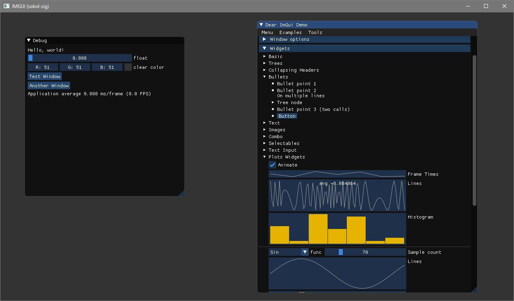
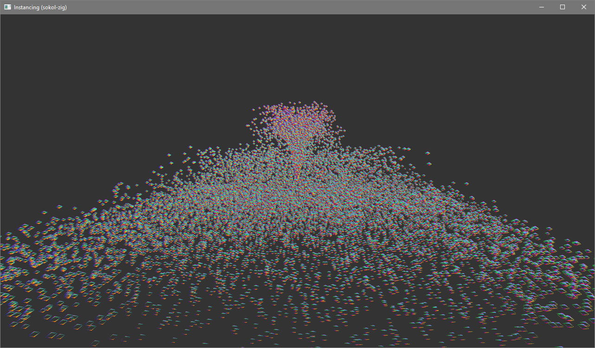
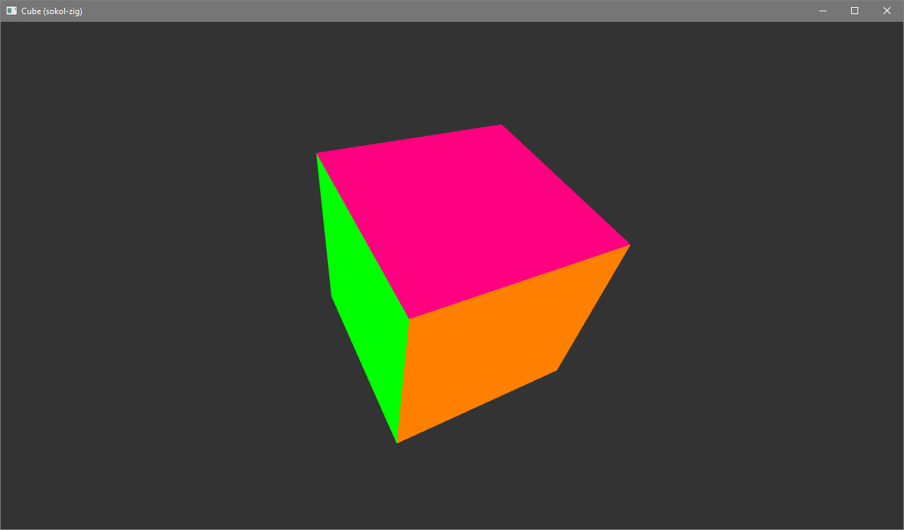
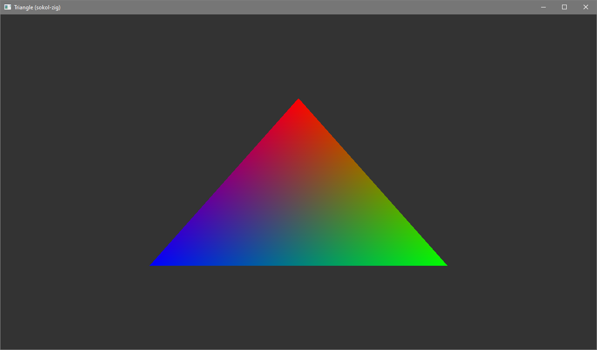

# Branch cimgui_186_update
Tracks issue where translate-c is converting ImGuiWindow to an opaque type.
To test:
```
git clone 
git checkout cimgui_186_update
git submodule update --init --recursive
cd src
zig build
```
Current output
```
.\example_imgui.zig:56:16: error: no member named 'SkipItems' in opaque type '.cimport:1:20.struct_ImGuiWindow'
    if (!window.SkipItems) {
               ^
```
Expected output: compiles without errors

Current translate-c results in cimport.zig:
```
pub const struct_ImGuiWindow = opaque {};
pub const ImGuiWindow = struct_ImGuiWindow;
```

c struct in cimgui.h
```
struct ImGuiWindow
{
    char* Name;
    ImGuiID ID;
    ImGuiWindowFlags Flags;
    ImVec2 Pos;
    ImVec2 Size;
    ImVec2 SizeFull;
    ImVec2 ContentSize;
    ImVec2 ContentSizeIdeal;
    ImVec2 ContentSizeExplicit;
    ImVec2 WindowPadding;
    float WindowRounding;
    float WindowBorderSize;
    int NameBufLen;
    ImGuiID MoveId;
    ImGuiID ChildId;
    ImVec2 Scroll;
    ImVec2 ScrollMax;
    ImVec2 ScrollTarget;
    ImVec2 ScrollTargetCenterRatio;
    ImVec2 ScrollTargetEdgeSnapDist;
    ImVec2 ScrollbarSizes;
    bool ScrollbarX, ScrollbarY;
    bool Active;
    bool WasActive;
    bool WriteAccessed;
    bool Collapsed;
    bool WantCollapseToggle;
    bool SkipItems;
    bool Appearing;
    bool Hidden;
    bool IsFallbackWindow;
    bool IsExplicitChild;
    bool HasCloseButton;
    signed char ResizeBorderHeld;
    short BeginCount;
    short BeginOrderWithinParent;
    short BeginOrderWithinContext;
    short FocusOrder;
    ImGuiID PopupId;
    ImS8 AutoFitFramesX, AutoFitFramesY;
    ImS8 AutoFitChildAxises;
    bool AutoFitOnlyGrows;
    ImGuiDir AutoPosLastDirection;
    ImS8 HiddenFramesCanSkipItems;
    ImS8 HiddenFramesCannotSkipItems;
    ImS8 HiddenFramesForRenderOnly;
    ImS8 DisableInputsFrames;
    ImGuiCond SetWindowPosAllowFlags : 8;
    ImGuiCond SetWindowSizeAllowFlags : 8;
    ImGuiCond SetWindowCollapsedAllowFlags : 8;
    ImVec2 SetWindowPosVal;
    ImVec2 SetWindowPosPivot;
    ImVector_ImGuiID IDStack;
    ImGuiWindowTempData DC;
    ImRect OuterRectClipped;
    ImRect InnerRect;
    ImRect InnerClipRect;
    ImRect WorkRect;
    ImRect ParentWorkRect;
    ImRect ClipRect;
    ImRect ContentRegionRect;
    ImVec2ih HitTestHoleSize;
    ImVec2ih HitTestHoleOffset;
    int LastFrameActive;
    float LastTimeActive;
    float ItemWidthDefault;
    ImGuiStorage StateStorage;
    ImVector_ImGuiOldColumns ColumnsStorage;
    float FontWindowScale;
    int SettingsOffset;
    ImDrawList* DrawList;
    ImDrawList DrawListInst;
    ImGuiWindow* ParentWindow;
    ImGuiWindow* ParentWindowInBeginStack;
    ImGuiWindow* RootWindow;
    ImGuiWindow* RootWindowPopupTree;
    ImGuiWindow* RootWindowForTitleBarHighlight;
    ImGuiWindow* RootWindowForNav;
    ImGuiWindow* NavLastChildNavWindow;
    ImGuiID NavLastIds[ImGuiNavLayer_COUNT];
    ImRect NavRectRel[ImGuiNavLayer_COUNT];
    int MemoryDrawListIdxCapacity;
    int MemoryDrawListVtxCapacity;
    bool MemoryCompacted;
};
```
The struct_ImGuiWindowTempData struct defined immidiately before it translates fine:
```
pub const struct_ImGuiWindowTempData = extern struct {
    CursorPos: ImVec2,
    CursorPosPrevLine: ImVec2,
    CursorStartPos: ImVec2,
    CursorMaxPos: ImVec2,
```


# sokol-zig-examples

Some of the Sokol examples running in Zig 0.9.0 (December 2021). Intended to be used as a reference or starting point for anyone looking to use Zig make games. Working platforms:
 - Windows (OpenGL)
 - MacOS (OpenGL)
 
With some modifications to the build.zig script it could be modified to target other platforms.

See
   - https://github.com/floooh/sokol
   - https://github.com/floooh/sokol-samples
   - https://github.com/floooh/sokol-zig
   - https://github.com/ziglang/zig

## Building

Clone

    git clone --recurse-submodules https://github.com/jeffkdev/sokol-zig-examples.git
    
    
Navigate to the /src directory and run application using:

    zig build run
    
   
To run different examples change the main file in the build.zig file:
```    const main_file = "example_instancing.zig"; ```

valid files are:
  example_imgui.zig

  
  example_instancing.zig


  example_cube.zig

  
  example_triangle.zig


  example_sound.zig
(plays beeping sound, blank screen)
  
  
## Shaders

The "glsl.h" shader files are generates from the ".glsl" files using. [sokol-shdc](https://github.com/floooh/sokol-tools). Since the glsl.h files are not created automatically when building right now they are checked in as well. If you modify the files, they can be re-generated using the command:

```
sokol-shdc.exe --input cube.glsl --output cube.glsl.h --slang glsl330 --format sokol_impl
```
A python file build_shaders.py is included for convenience that will create the required glsl.h files and the *_compile.c files which calls the above command for each listed file (requires sokol-shdc.exe in the environment paths).

The "--format sokol_impl" is important, otherwise they will be generated with inline declarations which caused issues using them in Zig. See the [documentation](https://github.com/floooh/sokol-tools/blob/master/docs/sokol-shdc.md) for more command line references.

## Debugging

Debugging and breakpoints are working in Visual Studio Code. Ideally there would be a launch config for each example, but right now it just runs the program.exe that is created from the zig build. Two files are required in the .vscode folder (not included in repo):

### tasks.json
```
  {
    "tasks":[
     {
      "group":"build",
      "problemMatcher":[
       "$msCompile"
      ],
      "command":"zig build",
      "label":"zig_build"
     },
    ],
    "presentation":{
     "reveal":"always",
     "clear":true
    },
    "version":"2.0.0",
    "type":"shell"
   }
 ```
### launch.json
```
{
  "version":"0.2.0",
  "configurations":[
   {
    "environment":[],
    "stopAtEntry":false,
    "program":"${workspaceRoot}/zig-out/bin/program.exe",
    "name":"program",
    "externalConsole":false,
    "preLaunchTask":"zig_build",
    "request":"launch",
    "args":[],
    "type":"cppvsdbg",
    "cwd":"${workspaceRoot}"
   }
  ]
 }
 ```
## License

Example files are based on the sokol-examples so they are probably considered a derivate work, so the MIT license will carry on to those as well.
